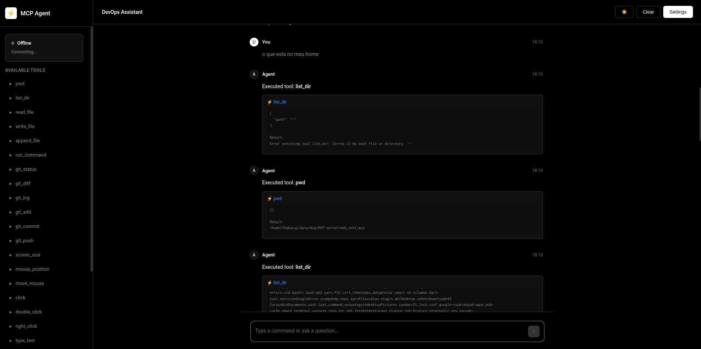
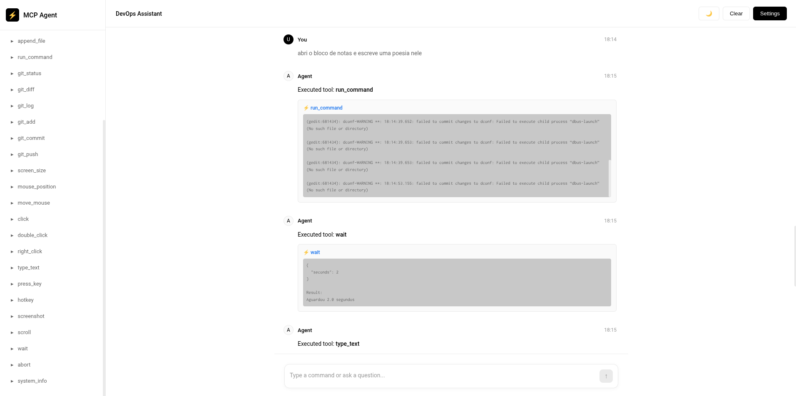

# MCP-server

**AGENT-DEVOPS-WEB**  
This project is nice.

In the future, I will use **smartagent-sf**: https://github.com/lhabacuc/smartagent  
in this project, when there is support for **mcp-e call-tools**.

## Images

### Image 1

### Image 2

[source](https://extendedlm.com/docs/mcp)
[ANTR](https://www.anthropic.com/news/model-context-protocol)
